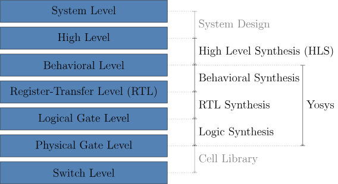

# [序言：Yosys是什么？](序言：Yosys是什么？.md)
# Yosys是什么？

Yosys最初是Claire Wolf的学士论文项目，旨在支持粗粒度可重构架构（CGRA, coarse-grained reconfigurable architecture）的综合。随后，它发展成为更通用的用于研究综合（synthesis）的基础。

现代的Yosys完全支持Verilog-2005的可综合子集，并被描述为"硬件综合的GCC"。Yosys是一个自由可用且[开源](https://github.com/YosysHQ/yosys)的工具，在业余爱好者、商业应用和学术领域都得到了广泛应用。

>*NOTE*
>
>Yosys采用ISC许可证：
>
>此许可证允许在保留原版权信息的情况下自由使用的代码，且不提供担保。ISC许可证在功能上等同于BSD 2-Clause和MIT许可证，删除了一些不再必要的语言。

Yosys可以和布局布线工具[nextpnr](https://github.com/YosysHQ/nextpnr)协同工作，实现在在全开源的工具流程下完成对一些FPGA芯片（Lattice iCE40和ECP5）的编程。Yosys还可以在[OpenLane flow](https://github.com/The-OpenROAD-Project/OpenLane)中负责综合的部分，可以使用SkyWater 130nm开源工艺设计包（PDK, Process Design Kit）实现全开源流程的ASIC设计。Yosys还可以进行形式验证，并支持例如SMT2等求解器格式的后端。

Yosys及其伴随的开源EDA生态系统目前由[Yosys Headquarters](https://github.com/YosysHQ)进行维护，其中许多核心开发人员是[YosysHQ GmbH](https://www.yosyshq.com/about)的员工。商业产品Tabby CAD Suite包括Verific前端，提供工业级的SystemVerilog和VHDL支持，以及带有SVA的形式化验证和形式化应用程序。

## Yosys能干什么？
 - 读取和处理（大多数）Verilog-2005代码
 - Yosys可以在网表（RTL、Logic、Gate）上执行各种操作
 - 使用ABC来实现优化和门级映射（Gate Mapping）
### 典型应用场景
 - 产品/项目最终的综合
 - 预生产综合（在正式使用之前，用于评估综合性能）
 - 将复杂的Verilog代码转换为简单的Verilog代码
 - 将Verilog代码转换成其他格式（BLIF、BTOR等）
 - 阐述综合算法（应用在教学领域）
 - 新算法的实验平台
 - 构建定制的工作流（Yosys不仅可以用于综合，还可以用于形式验证和逆向工程）
### Yosys目前不能做到的事情
 - 处理高级语言，例如C/CPP/SystemC
 - 在物理版图上布局布线
	 - 请参照[nextpnr](https://github.com/YosysHQ/nextpnr)来实现此需求

## Yosys相关延伸项目

- SBY for formal verification
    - [https://github.com/YosysHQ/sby](https://github.com/YosysHQ/sby)
    - [https://yosyshq.readthedocs.io/projects/sby](https://yosyshq.readthedocs.io/projects/sby)
    
- EQY for equivalence checking
    - [https://github.com/YosysHQ/eqy](https://github.com/YosysHQ/eqy)
    - [https://yosyshq.readthedocs.io/projects/eqy](https://yosyshq.readthedocs.io/projects/eqy)
    
- MCY for mutation coverage
    - [https://github.com/YosysHQ/mcy](https://github.com/YosysHQ/mcy)
    - [https://yosyshq.readthedocs.io/projects/mcy](https://yosyshq.readthedocs.io/projects/mcy)
        
- SCY for deep formal traces
    - [https://github.com/YosysHQ/scy](https://github.com/YosysHQ/scy)

## 最初的论文摘要
最初版本的Yosys文档是被发表在维也纳科技大学的本科论文上。
>Most of today’s digital design is done in HDL code (mostly Verilog or VHDL) and with the help of HDL synthesis tools.

如今的数字电路设计都是在HDL综合工具的帮助下，由HDL代码（大多数为Verilog或VHDL语言）进行设计的。

>In special cases such as synthesis for coarse-grain cell libraries or when testing new synthesis algorithms it might be necessary to write a custom HDL synthesis tool or add new features to an existing one. In these cases the availability of a Free and Open Source (FOSS) synthesis tool that can be used as basis for custom tools would be helpful.

在一些粗颗粒度的综合或测试某种新的综合算法时，可能需要重写一个定制化的综合工具或向现有的综合工具中添加新功能。在这种情况下，一个开源的综合工具能够提供很好的基础。

>In the absence of such a tool, the Yosys Open SYnthesis Suite (Yosys) was developed. This document covers the design and implementation of this tool. At the moment the main focus of Yosys lies on the high-level aspects of digital synthesis. The pre-existing FOSS logic-synthesis tool ABC is used by Yosys to perform advanced gate-level optimizations.

在缺乏这种开源综合工具的情况下，Yosys得以被开发。本文档介绍了Yosys的设计和实现。目前Yosys的主要侧重点为高层次的数字综合方面。Yosys使用了先前已有的开源逻辑综合工具ABC来进行高级门级优化。

>An evaluation of Yosys based on real-world designs is included. It is shown that Yosys can be used as-is to synthesize such designs. The results produced by Yosys in this tests where successfully verified using formal verification and are comparable in quality to the results produced by a commercial synthesis tool.

Yosys使用了真实的案例来进行验证功能正确性。结果表明了Yosys可以正确的进行综合，并与商业综合工具进行对比，结果表明在综合质量上与商业工具相当。

>Yosys is a Verilog HDL synthesis tool. This means that it takes a behavioural design description as input and generates an RTL, logical gate or physical gate level description of the design as output. Yosys’ main strengths are behavioural and RTL synthesis. A wide range of commands (synthesis passes) exist within Yosys that can be used to perform a wide range of synthesis tasks within the domain of behavioural, rtl and logic synthesis. Yosys is designed to be extensible and therefore is a good basis for implementing custom synthesis tools for specialised tasks.

Yosys是一个Verilog HDL综合工具，意味着它可以将输入的行为设计描述转换为RTL级、逻辑门级或物理门级进行输出。Yosys主打行为级和RTL级的综合。Yosys有很多指令（综合步骤）用于处理行为级、RTL级、逻辑门级的多种综合任务。

## 使用开源综合工具的好处
 - 节省开销
	- 如今，采用 180nm 技术的掩模组的成本远远低于设计掩模布局所需的设计工具的成本。开源 ASIC 流程是 ASIC 级开源硬件的重要推动者。
 - 可用性和可发表性
	 - 如果您是一名正在发表文章的研究人员，您希望使用其他人也可以使用的工具。即使大多数大学都可以访问所有主要的商业工具，您通常也无法轻松访问几年前研究项目中使用的版本。借助开源工具，您甚至可以与数据一起发布您所使用的工具的源代码。
 - 作为二次开发框架
	- Yosys 不仅仅是一个工具。它是一个可以用作其他开发基础的框架，因此研究人员不需要重新发明基本功能。可扩展性是 Yosys 的设计目标之一。
 - 功能集成
	 - 由于 Yosys 的框架特性，越来越多的功能可以在一个工具中使用。 Yosys 不仅可用于电路综合，还可用于形式等价检查、SAT 求解和电路分析等等。对于其他的专有软件，人们需要为每个应用程序学习一种新工具。 
 - 良好的综合原理教学工具
	 - 专有综合工具有时对其内部工作原理非常保密。它们通常是黑盒子。 Yosys对其内部数据结构非常开放，很容易对综合过程中的每个步骤进行观察。

## Yosys的历史
硬件描述语言（HDL）是一种用于描述电路的计算机语言。 HDL 综合工具是一种计算机程序，它将用 HDL 编写的电路的形式描述作为输入，并生成实现给定电路的网表作为输出。

目前最广泛使用的HDL是Verilog和VHDL。这两种HDL都用于数字电路测试和验证目的以及逻辑综合。两种语言中都包含了可综合（Synthesizable）和不可综合（non-Synthesizable）的部分。在本文档中，我们只关注语言特性的可综合的部分。

由于作者（指Claire Wolf）对Verilog的偏好，早期决定使用Verilog而不是VHDL 。当评估了现有的FOSS Verilog综合工具后，结果非常令人失望。因此，作者实现了一个全新的Verilog综合工具，并将其作为可二次开发的综合工具的基础。本文讨论的就是这个工具。

